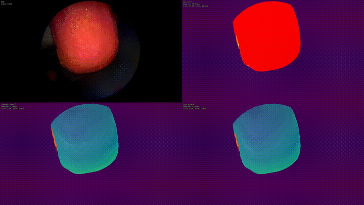
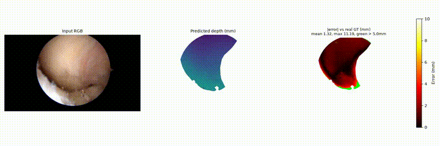

<h1 style="border-bottom: none; margin-bottom: 0px">ArthroDepth</h1>
<h3 style="border-top: none; margin-top: 3px;">Monocular metric depth for arthroscopic knee navigation</h3>

1. PROJECT

ARTHRONAV, AREAS SAS. Goal: real-time monocular metric depth estimation on
arthroscopic knee video, as a building block for surgical navigation
(depth + camera pose + segmentation).

Approach: fine-tune Depth Anything 3 (DA3METRIC-LARGE, 336.5M params) with
Vector-LoRA (DARES-derived rank schedule, q/v attention only, ~0.3% of
parameters trainable). Supervised, masked L1 loss on pixels with real ground
truth. Ground truth comes from three different sources depending on dataset:

    SCARED        real endoscopic footage, active structured-light depth
                  (domain bridge, not knee tissue)
    sawbone       a physical phantom (red, then a second case "white"),
                  ground truth from ray-tracing a known 3D-scanned mesh
                  against tracked (OptiTrack) camera pose
    real patient  our own cohort (8 patients, two recording sites), ground
                  truth from a model-based ray-traced reprojection pipeline:
                  a segmentation model locates the anatomy per frame, the
                  bones are tracked, a patient-specific 3D surface scan is
                  registered via calibration, and depth is ray-traced against
                  that positioned model -- not stereo photogrammetry

Data lives on the NAS at /mnt/areas_nas/SLAM/:

    scared_dataset_full_copy/        SCARED, h5 per frame
    sawbone_dataset/                 red sawbone phantom
    sawbone_white_dataset/           white sawbone phantom, already cropped
    real_knee_dataset/               8 patients, per-clip, uncropped
    real_knee_combined_dataset/      same 8 patients, cropped, combined,
                                      the dataset the current best model uses

2. ARTHRONAV/ -- IO AND TRAINING

Per-dataset IO + PyTorch Dataset pairs:

    scared_io.py / scared_dataset.py
    sawbone_io.py / sawbone_dataset.py            (red phantom)
    real_knee_io.py / real_knee_dataset.py        (original 8-patient, per-clip)

The combined real-knee dataset and the white-sawbone dataset read directly
from their prepared folders (flat file lists) rather than a dedicated
Dataset/IO pair, see train_real_knee_combined.py and train_sawbone_white.py.

Shared utilities:

    lora.py       inject_vector_lora() -- the adapter used everywhere
    losses.py     masked_l1_loss
    metrics.py    abs_rel, rmse, abs_error_stats
    crop_utils.py crop_and_resize, shared by every cropping/prep script

Training entry points, one per dataset (all default to Vector-LoRA, all
accept --init-checkpoint to continue from an existing checkpoint instead of
base DA3METRIC-LARGE):

    train_scared.py
    test_sawbone.py --mode {zero_shot,transfer_scared,from_scratch}
    train_sawbone_white.py
    train_real_knee.py                (original 5-patient, uncropped, mm)
    train_real_knee_combined.py       (current best: 8 patients, cropped, m)

Matching validate_*.py for each, taking --checkpoint and, where relevant,
--split {val,test}.

3. THE CROPPING

Arthroscopic video shows a circular field of view inside a black rectangular
frame (the endoscope's optics). Two different situations:

    Real surgery (real_knee)      the circle moves frame to frame as the
                                   scope shifts -- detected per frame,
                                   precompute_circle_masks.py, written to
                                   circle_boxes.json per clip

    Sawbone benchtop rig          the circle stays fixed for a whole
    (red and white)                sequence -- detected once per sequence,
                                   precompute_crop_boxes.py /
                                   precompute_crop_boxes_sawbone_white.py

Detection uses an in-house tool, areas_theta_compute's CircleDetector (built
on opencv-contrib-python), referred to informally as the notch detector.
It writes its result to a JSON file and nothing else reads cv2 downstream:
build_combined_real_knee_dataset.py and prepare_sawbone_white_data.py apply
the actual crop (using crop_utils.py) and resize to 1022x1022 using the
already-computed boxes, no detector involved at that stage.

4. REQUIREMENTS AND HOW TO RUN

Confirmed working versions (from the venv currently used for training):

    torch==2.13.0
    torchvision==0.28.0
    xformers==0.0.35
    opencv-python==4.11.0.86
    addict==2.4.0
    depth-anything-3   editable install of this repo itself (pip install -e .)

Setup:

    python3 -m venv venv
    source venv/bin/activate
    pip install torch torchvision xformers
    pip install -e .
    pip install addict opencv-python

If pip itself isn't found even with the venv active, use
"venv/bin/python -m pip ..." directly rather than relying on PATH.

If you rename or move this repo's folder after installing, the editable
install breaks silently (it hardcodes the original absolute path) --
rerun "pip install -e ." from the new location to fix it. This happened to
us once already.

The circle detector (areas_theta_compute, opencv-contrib-python) is kept in
a separate venv from torch, because the two bring in conflicting cuDNN
builds that crash if loaded in the same process
(CUDNN_STATUS_SUBLIBRARY_VERSION_MISMATCH). Run detection standalone first,
in that separate venv, before switching back to the main venv for
everything else.

Example: training the current best real-knee model, from scratch:

    source venv/bin/activate
    python -m arthronav.train_real_knee_combined --epochs 5 \
        --checkpoint-dir checkpoints/real_knee_combined_from_scratch

5. RESULTS AND METRICS

Best real-knee model: train_real_knee_combined.py, from-scratch, epoch 1.
AbsRel 0.1822 on both validation and the true held-out test patients (no
validation/test divergence, unlike the earlier 5-patient pipeline where a
transfer-learning checkpoint reversed rankings between validation and test).

Best sawbone transfer: continuing from the red-sawbone checkpoint onto the
white-sawbone dataset roughly halves AbsRel at every matching epoch versus
training from scratch (0.0334 vs 0.0746 at epoch 2), the cleanest transfer
effect found across every dataset in this project.

Sawbone (red to white transfer), best checkpoint on a held-out test
sequence:

Real patient data, from-scratch checkpoint on a held-out test patient:

Full-length videos for both are in results/ (sawbone_comparison_lateral3.mp4,
from_scratch_best_test_patient.mp4).
